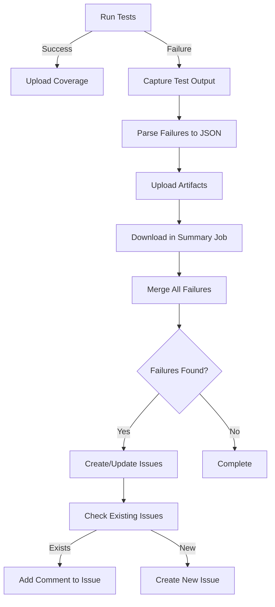

# Pipeline Scripts

This directory contains scripts used in the GitHub Actions CI/CD pipeline for the terraform-provider-microsoft365 project.

## 📜 Scripts Overview

### ✅ Active Scripts

#### `run-tests.sh`
**Purpose:** Runs acceptance tests and captures test failures  
**Usage:** `./run-tests.sh <type> [service] [coverage-file] [test-output-file]`

**Parameters:**
- `type`: Type of tests to run (`provider-core`, `resources`, `datasources`)
- `service`: Service name (required for resources/datasources tests)
- `coverage-file`: Output file for coverage data (default: `coverage.txt`)
- `test-output-file`: Output file for test logs (default: `test-output.log`)

**Features:**
- Runs Go tests with race detection
- Captures test output for failure analysis
- Generates JSON report of failing tests (`test-failures.json`)
- Allows tests to fail gracefully (uses `continue-on-error`)
- Includes test context (error messages, stack traces)

**Output:**
- `test-failures.json`: Structured JSON with failing test details
- `test-output-*.log`: Raw test output logs
- `coverage-*.txt`: Coverage profile

#### `create-test-issues.sh`
**Purpose:** Creates individual GitHub issues for each failing test  
**Usage:** `./create-test-issues.sh <owner> <repo> <run-id> <failures-json>`

**Parameters:**
- `owner`: GitHub repository owner
- `repo`: Repository name
- `run-id`: Workflow run ID
- `failures-json`: Path to test failures JSON file

**Features:**
- **Individual Issue Per Test**: Each failing test gets its own issue
- **De-duplication**: Checks if issue already exists by test name
- **Auto-update**: If issue exists, adds comment with latest failure info
- **Rich Context**: Includes test name, service path, failure context, workflow links
- **Automatic Labels**: Tags issues with `bug`, `nightly-test-failure`, `automated`

**Behavior:**
- **New Failure**: Creates new issue with title `🔴 Nightly Test Failure: TestName`
- **Existing Failure**: Updates existing issue with comment containing latest run info
- **Resolved Tests**: Issues remain open until manually closed (after verification)

#### `map-credentials.sh`
**Purpose:** Maps service-specific credentials to environment variables  
**Usage:** `./map-credentials.sh <service>`

**Parameters:**
- `service`: Service name (e.g., `device_and_app_management`, `groups`)

**Features:**
- Maps service-specific `M365_CLIENT_ID_*` and `M365_CLIENT_SECRET_*` to generic `M365_CLIENT_ID` and `M365_CLIENT_SECRET`
- Sets `SKIP_TESTS=true` if credentials are not configured
- Enables per-service credential management

### ⚠️ Deprecated Scripts

#### `report-failure.sh` (DEPRECATED)
**Status:** ⛔ No longer used  
**Replaced By:** `create-test-issues.sh`

**Why Deprecated:**
- Created PRs (unnecessary overhead)
- Created single issue for all failures (poor granularity)
- No de-duplication logic
- No per-test tracking

**Migration:**
The workflow now uses `create-test-issues.sh` which provides:
- Individual issues per failing test
- Automatic de-duplication
- Better tracking and resolution workflow
- No unnecessary PR creation

#### `merge-coverage.sh`
**Status:** ⚠️ Potentially obsolete  
**Note:** Codecov now handles automatic report merging. This script may be removed in the future.

## 🔄 Workflow Integration

### Nightly Test Workflow Flow



### Test Failure Issue Lifecycle

1. **Detection**: Test fails in nightly run
2. **Artifact Upload**: `test-failures.json` uploaded as artifact
3. **Aggregation**: Summary job downloads all artifacts
4. **De-duplication**: Script checks for existing issues by test name
5. **Issue Creation**:
   - **If new**: Create issue with title `🔴 Nightly Test Failure: TestName`
   - **If exists**: Add comment with latest failure details
6. **Resolution**: Developer fixes test and manually closes issue

### Example Issue Format

**Title:** `🔴 Nightly Test Failure: TestAccAndroidPolicyResource_Lifecycle`

**Body:**
```markdown
## Test Failure Details

**Test Name:** `TestAccAndroidPolicyResource_Lifecycle`
**Service Path:** `resources/device_and_app_management`
**First Detected:** 2025-11-14
**Workflow Run:** [123456](link)

### Failure Context
```
--- FAIL: TestAccAndroidPolicyResource_Lifecycle (5.23s)
    resource_test.go:45: Expected success but got error...
```

### Action Items
- [ ] Review workflow logs
- [ ] Identify root cause
- [ ] Fix failing test
- [ ] Verify in next nightly run
- [ ] Close issue when resolved
```

## 🏷️ Issue Labels

Issues created by `create-test-issues.sh` use these labels:

- `bug`: Indicates a problem that needs fixing
- `nightly-test-failure`: Identifies automated nightly test failures
- `automated`: Marks as automatically generated

## 🔍 Troubleshooting

### No Issues Created

**Problem:** Tests fail but no issues are created  
**Causes:**
- `test-failures.json` is empty
- No failing tests matched the `--- FAIL:` pattern
- `GITHUB_TOKEN` permissions insufficient

**Solution:**
1. Check test output logs in artifacts
2. Verify `test-failures.json` contains data
3. Ensure workflow has `issues: write` permission

### Duplicate Issues

**Problem:** Multiple issues created for same test  
**Causes:**
- Test name variation (e.g., TestFoo vs TestFoo/subtest)
- Issue title search not matching

**Solution:**
- Issue titles use exact test name for matching
- Script searches for `in:title "TestName"`
- Ensure test names are stable

### Missing Context

**Problem:** Issue created but no failure details  
**Causes:**
- Test output parsing failed
- Context extraction logic didn't match output format

**Solution:**
- Check `test-output-*.log` artifacts
- Verify Go test output follows standard format
- Update parse logic in `run-tests.sh` if needed

## 🚀 Future Improvements

Potential enhancements:

1. **Auto-close Resolved Issues**: Close issues when test passes in subsequent run
2. **Flaky Test Detection**: Track failure frequency, label tests that fail intermittently
3. **Trend Analysis**: Add metrics on failure rates over time
4. **Slack/Teams Integration**: Notify team channels of new failures
5. **Test Retry Logic**: Automatically retry failed tests once
6. **Priority Assignment**: Auto-assign priority based on test criticality

## 📚 Related Documentation

- [GitHub Actions Workflow](.github/workflows/nightly-tests.yml)
- [Testing Guide](../../docs/TESTING.md)
- [Contributing Guidelines](../../CONTRIBUTING.md)

