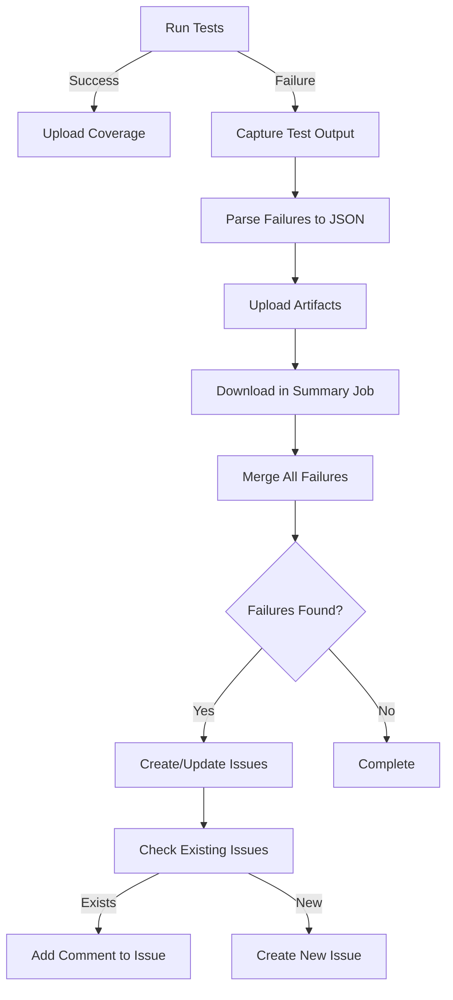

# Pipeline Scripts

This directory contains scripts used in the GitHub Actions CI/CD pipeline for the terraform-provider-microsoft365 project.

## 📜 Scripts Overview

### ✅ Active Scripts

#### `run-tests.sh`
**Purpose:** Runs acceptance tests and captures test failures  
**Usage:** `./run-tests.sh <type> [service] [coverage-file] [test-output-file]`

**Parameters:**
- `type`: Type of tests to run (`provider-core`, `resources`, `datasources`)
- `service`: Service name (required for resources/datasources tests)
- `coverage-file`: Output file for coverage data (default: `coverage.txt`)
- `test-output-file`: Output file for test logs (default: `test-output.log`)

**Features:**
- Runs Go tests with race detection
- Captures test output for failure analysis
- Generates JSON report of failing tests (`test-failures.json`)
- Allows tests to fail gracefully (uses `continue-on-error`)
- Includes test context (error messages, stack traces)

**Output:**
- `test-failures.json`: Structured JSON with failing test details
- `test-output-*.log`: Raw test output logs
- `coverage-*.txt`: Coverage profile

#### `create-test-issues.sh`
**Purpose:** Creates test failure reports for each failing test (not incidents)  
**Usage:** `./create-test-issues.sh <owner> <repo> <run-id> <failures-json>`

**Parameters:**
- `owner`: GitHub repository owner
- `repo`: Repository name
- `run-id`: Workflow run ID
- `failures-json`: Path to test failures JSON file

**Features:**
- **Individual Report Per Test**: Each failing test gets its own report
- **De-duplication**: Checks if report already exists by test name
- **Auto-update**: If report exists, adds comment with latest occurrence
- **Clear Classification**: Distinguishes test failures from production incidents
- **Escalation Criteria**: Provides guidelines for when to escalate to incident
- **Rich Context**: Includes failure details, impact assessment, investigation checklist
- **Automatic Labels**: Tags with `test-failure`, `automated`, `needs-triage`
- **Recurring Detection**: Adds `recurring` label for repeated failures

**Behavior:**
- **New Failure**: Creates report with title `Test Failure: TestName`
- **Existing Failure**: Updates report with latest occurrence
- **Escalation**: Manual escalation to incident if criteria met (3+ failures, blocks deployment, etc.)
- **Resolution**: Reports closed when test passes and root cause documented

#### `map-credentials.sh`
**Purpose:** Maps service-specific credentials to environment variables  
**Usage:** `./map-credentials.sh <service>`

**Parameters:**
- `service`: Service name (e.g., `device_and_app_management`, `groups`)

**Features:**
- Maps service-specific `M365_CLIENT_ID_*` and `M365_CLIENT_SECRET_*` to generic `M365_CLIENT_ID` and `M365_CLIENT_SECRET`
- Sets `SKIP_TESTS=true` if credentials are not configured
- Enables per-service credential management

### ⚠️ Deprecated Scripts

#### `report-failure.sh` (DEPRECATED)
**Status:** ⛔ No longer used  
**Replaced By:** `create-test-issues.sh`

**Why Deprecated:**
- Created PRs (unnecessary overhead)
- Created single issue for all failures (poor granularity)
- No de-duplication logic
- No per-test tracking

**Migration:**
The workflow now uses `create-test-issues.sh` which provides:
- Individual issues per failing test
- Automatic de-duplication
- Better tracking and resolution workflow
- No unnecessary PR creation

#### `merge-coverage.sh`
**Status:** ⚠️ Potentially obsolete  
**Note:** Codecov now handles automatic report merging. This script may be removed in the future.

## 🔄 Workflow Integration

### Nightly Test Workflow Flow



### Test Failure Report Lifecycle

1. **Detection**: Test fails in nightly run
2. **Artifact Upload**: `test-failures.json` uploaded as artifact
3. **Aggregation**: Summary job downloads all artifacts
4. **De-duplication**: Script checks for existing reports by test name
5. **Report Creation**:
   - **If new**: Create report with title `Test Failure: TestName`
   - **If exists**: Add update comment and apply `recurring` label
6. **Triage**: Developer investigates and classifies (flaky test, genuine bug, environment issue, test maintenance)
7. **Escalation** (if needed): Convert to incident if meets escalation criteria
8. **Resolution**: Developer fixes issue, documents root cause, and closes report

### Example Test Failure Report

**Title:** `Test Failure: TestAccAndroidPolicyResource_Lifecycle`

**Body:**
```markdown
## Test Failure Report

**Status:** Under Investigation  
**Test Name:** `TestAccAndroidPolicyResource_Lifecycle`  
**Service Area:** `resources/device_and_app_management`  
**First Detected:** 2025-11-14  
**Workflow Run:** [123456](link)

## Failure Details

### Test Information

- **Test Path:** `TestAccAndroidPolicyResource_Lifecycle`
- **Test Type:** Acceptance Test
- **Service:** resources/device_and_app_management
- **Failure Pattern:** First Occurrence

### Failure Context

```
--- FAIL: TestAccAndroidPolicyResource_Lifecycle (5.23s)
    resource_test.go:45: Expected success but got error...
```

## Impact Assessment

**Pre-Production Environment:**
- ⚠️ Test suite quality gate failing
- ⚠️ Potential regression if deployed to production
- ✅ No customer impact (pre-production only)

**Severity Classification:**
- **Not Yet an Incident** - No production service disruption
- **Could Escalate** - If persists or blocks critical deployments

## Investigation Required

### Initial Analysis Checklist

- [ ] Review workflow logs for details
- [ ] Identify root cause (code change, environment, flaky test)
- [ ] Determine severity and regression risk
- [ ] Check if this affects production release readiness

### Classification Decision

After investigation, classify this failure:

- [ ] **Flaky Test** - Intermittent failure, test needs improvement
- [ ] **Environment Issue** - Test infrastructure problem
- [ ] **Genuine Bug** - Code defect requiring fix
- [ ] **Test Maintenance** - Test needs updating for new behavior

### Escalation Criteria

**Escalate to INCIDENT if:**
- Test fails 3+ consecutive times (persistent failure)
- Failure blocks critical production deployment
- Failure indicates production service degradation
- Security or data integrity concern

## Resolution Actions

- [ ] Fix identified root cause
- [ ] Verify fix locally and in CI/CD
- [ ] Document findings
- [ ] Close report when test passes
- [ ] Update test if maintenance needed
```

## 🏷️ Report Labels

Test failure reports created by `create-test-issues.sh` use these labels:

- `test-failure`: Indicates a test failure report (not an incident)
- `automated`: Marks as automatically generated
- `needs-triage`: Requires investigation and classification
- `recurring`: Added when test fails multiple times (auto-applied on recurrence)

### Label Lifecycle

**Initial:** `test-failure`, `automated`, `needs-triage`  
**After Triage:** Remove `needs-triage`, add one of:
- `flaky-test`: Intermittent failures
- `test-maintenance`: Test needs updating
- `bug`: Genuine code defect
- `environment`: Infrastructure issue

**Escalation:** If escalated, add `incident` label and update title

## 🔍 Troubleshooting

### No Reports Created

**Problem:** Tests fail but no reports are created  
**Causes:**
- `test-failures.json` is empty
- No failing tests matched the `--- FAIL:` pattern
- `GITHUB_TOKEN` permissions insufficient

**Solution:**
1. Check test output logs in artifacts
2. Verify `test-failures.json` contains data
3. Ensure workflow has `issues: write` permission

### Duplicate Reports

**Problem:** Multiple reports created for same test  
**Causes:**
- Test name variation (e.g., TestFoo vs TestFoo/subtest)
- Report title search not matching

**Solution:**
- Report titles use exact test name for matching
- Script searches for `in:title "Test Failure: TestName"`
- Ensure test names are stable

### Missing Context

**Problem:** Report created but no failure details  
**Causes:**
- Test output parsing failed
- Context extraction logic didn't match output format

**Solution:**
- Check `test-output-*.log` artifacts
- Verify Go test output follows standard format
- Update parse logic in `run-tests.sh` if needed

### When is it an Incident?

**Question:** How do I know if a test failure should be escalated to an incident?

**Answer:** Use these criteria:

| Criteria | Test Failure | Incident |
|----------|-------------|----------|
| **Customer Impact** | None (pre-prod) | Yes (production affected) |
| **Service Status** | Running normally | Service degraded/down |
| **Deployment Status** | Tests failing | Deployment blocked |
| **Failure Pattern** | 1-2 occurrences | 3+ consecutive failures |
| **Severity** | Potential regression | Active regression |

**Escalation Process:**
1. Test fails 3+ times in a row → Escalate
2. Failure blocks critical deployment → Escalate  
3. Failure indicates prod issue → Escalate
4. Otherwise → Keep as test failure report

## 🚀 Future Improvements

Potential enhancements:

1. **Auto-close Resolved Reports**: Close reports when test passes in subsequent run
2. **Flaky Test Detection**: Track failure frequency, auto-label intermittent failures
3. **Auto-escalation**: Automatically escalate to incident after 3 consecutive failures
4. **Trend Analysis**: Add metrics on failure rates and patterns over time
5. **Slack/Teams Integration**: Notify team channels of new failures and escalations
6. **Test Retry Logic**: Automatically retry failed tests once before reporting
7. **Classification ML**: Use patterns to suggest classification (flaky vs bug)
8. **SLA Tracking**: Monitor time-to-resolution for test failures

## 📚 Related Documentation

- [GitHub Actions Workflow](.github/workflows/nightly-tests.yml)
- [Testing Guide](../../docs/TESTING.md)
- [Contributing Guidelines](../../CONTRIBUTING.md)

