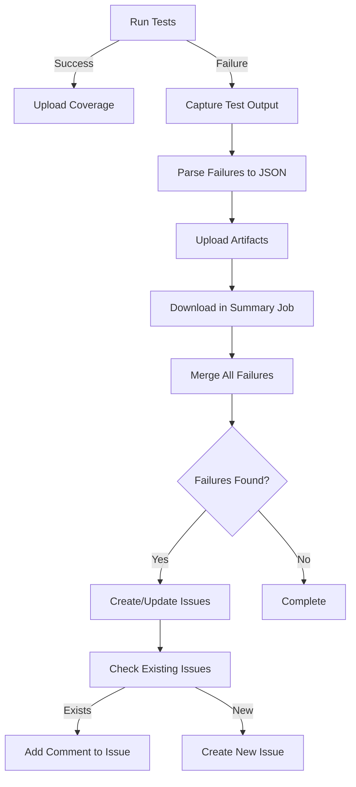

# Pipeline Scripts

This directory contains scripts used in the GitHub Actions CI/CD pipeline for the terraform-provider-microsoft365 project.

## 📜 Scripts Overview

### ✅ Active Scripts

#### `run-tests.py`
**Purpose:** Runs acceptance tests and captures test failures  
**Usage:** `./run-tests.py <type> [service] [coverage-file] [test-output-file]`

**Parameters:**
- `type`: Type of tests to run (`provider-core`, `resources`, `datasources`)
- `service`: Service name (required for resources/datasources tests)
- `coverage-file`: Output file for coverage data (default: `coverage.txt`)
- `test-output-file`: Output file for test logs (default: `test-output.log`)

**Features:**
- Runs Go tests with race detection
- Captures test output for failure analysis
- Generates JSON report of failing tests (`test-failures.json`)
- Allows tests to fail gracefully (uses `continue-on-error`)
- Includes test context (error messages, stack traces)

**Output:**
- `test-failures.json`: Structured JSON with failing test details
- `test-output-*.log`: Raw test output logs
- `coverage-*.txt`: Coverage profile

#### `create-test-issues.py`
**Purpose:** Creates GitHub issues for failing tests with factual error details  
**Usage:** `./create-test-issues.py <owner> <repo> <run-id> <failures-json>`

**Parameters:**
- `owner`: GitHub repository owner
- `repo`: Repository name
- `run-id`: Workflow run ID
- `failures-json`: Path to test failures JSON file

**Features:**
- **Individual Issue Per Test**: Each failing test gets its own issue
- **De-duplication**: Automatically detects and updates existing issues
- **Factual Reporting**: Contains only actionable information (test name, error, service, date, workflow link)
- **Recurring Detection**: Adds `recurring` label for repeated failures
- **Automatic Labels**: Tags with `test-failure`, `automated`

**Issue Contents:**
- Test name (as title)
- Service area
- Failure date
- Workflow run ID and URL
- Error output
- Links to test source and logs

**Behavior:**
- **New Failure**: Creates issue with test name as title
- **Existing Failure**: Adds comment with latest occurrence details
- **Resolution**: Close issue when test is fixed

#### `map-credentials.py`
**Purpose:** Maps service-specific credentials to environment variables  
**Usage:** `./map-credentials.py <service>`

**Parameters:**
- `service`: Service name (e.g., `device_and_app_management`, `groups`)

**Features:**
- Maps service-specific `M365_CLIENT_ID_*` and `M365_CLIENT_SECRET_*` to generic `M365_CLIENT_ID` and `M365_CLIENT_SECRET`
- Sets `SKIP_TESTS=true` if credentials are not configured
- Enables per-service credential management

### ⚠️ Deprecated Scripts

#### `report-failure.py` (DEPRECATED)
**Status:** ⛔ No longer used  
**Replaced By:** `create-test-issues.py`

**Why Deprecated:**
- Created PRs (unnecessary overhead)
- Created single issue for all failures (poor granularity)
- No de-duplication logic
- No per-test tracking

**Migration:**
The workflow now uses `create-test-issues.py` which provides:
- Individual issues per failing test
- Automatic de-duplication
- Better tracking and resolution workflow
- No unnecessary PR creation

#### `merge-coverage.py`
**Status:** ⚠️ Potentially obsolete  
**Note:** Codecov now handles automatic report merging. This script may be removed in the future.

## 🔄 Workflow Integration

### Nightly Test Workflow Flow



### Test Failure Report Lifecycle

1. **Detection**: Test fails in nightly run
2. **Artifact Upload**: `test-failures.json` uploaded as artifact
3. **Aggregation**: Summary job downloads all artifacts
4. **De-duplication**: Script checks for existing issues by test name
5. **Issue Creation**:
   - **If new**: Create issue with test name as title
   - **If exists**: Add comment with latest failure and apply `recurring` label
6. **Resolution**: Fix issue and close when test passes

### Example Issue

**Title:** `TestAccAndroidPolicyResource_Lifecycle`

**Body:**
```markdown
## Test Failure

**Test:** `TestAccAndroidPolicyResource_Lifecycle`  
**Service:** `resources/device_and_app_management`  
**Date:** 2025-11-15  
**Workflow:** [19383092062](https://github.com/deploymenttheory/terraform-provider-microsoft365/actions/runs/19383092062)

### Error Output

```
--- FAIL: TestAccAndroidPolicyResource_Lifecycle (5.23s)
    resource_test.go:45: Error applying: 
    Error: Provider produced inconsistent result after apply
    
    When applying changes to microsoft365_graph_beta_device_and_app_management_android_managed_device_app_configuration_policy.test,
    provider "registry.terraform.io/deploymenttheory/microsoft365" produced an unexpected new value:
    .assignments: was null, but now cty.SetValEmpty(cty.Object(map[string]cty.Type{"target":cty.Object...
```

### Resources

- [Workflow Logs](https://github.com/deploymenttheory/terraform-provider-microsoft365/actions/runs/19383092062)
- [Test Source](../../internal/services/resources/device_and_app_management)

---
*Automated report from nightly tests*
```

## 🏷️ Issue Labels

Issues created by `create-test-issues.py` use these labels:

- `test-failure`: Identifies failing test issues
- `automated`: Automatically generated
- `recurring`: Added when test fails multiple times

### Label Lifecycle

**Initial:** `test-failure`, `automated`  
**Recurring:** Adds `recurring` label automatically  
**Manual Labels:** Add as needed:
- `bug`: Code defect
- `flaky-test`: Intermittent failures  
- `wontfix`: Test issue, but not fixing

## 🔍 Troubleshooting

### No Reports Created

**Problem:** Tests fail but no reports are created  
**Causes:**
- `test-failures.json` is empty
- No failing tests matched the `--- FAIL:` pattern
- `GITHUB_TOKEN` permissions insufficient

**Solution:**
1. Check test output logs in artifacts
2. Verify `test-failures.json` contains data
3. Ensure workflow has `issues: write` permission

### Duplicate Reports

**Problem:** Multiple reports created for same test  
**Causes:**
- Test name variation (e.g., TestFoo vs TestFoo/subtest)
- Report title search not matching

**Solution:**
- Issue titles are the exact test name
- Script searches for `in:title "TestName"`
- Ensure test names are stable

### Missing Context

**Problem:** Report created but no failure details  
**Causes:**
- Test output parsing failed
- Context extraction logic didn't match output format

**Solution:**
- Check `test-output-*.log` artifacts
- Verify Go test output follows standard format
- Update parse logic in `run-tests.py` if needed

## 🚀 Future Improvements

Potential enhancements:

1. **Auto-close Resolved Issues**: Close issues when test passes in subsequent run
2. **Flaky Test Detection**: Track failure frequency, auto-label intermittent failures
3. **Trend Analysis**: Add metrics on failure rates and patterns over time
4. **Test Retry Logic**: Automatically retry failed tests once before reporting
5. **Slack/Teams Integration**: Notify team channels of new failures

## 📚 Related Documentation

- [GitHub Actions Workflow](.github/workflows/nightly-tests.yml)
- [Testing Guide](../../docs/TESTING.md)
- [Contributing Guidelines](../../CONTRIBUTING.md)

